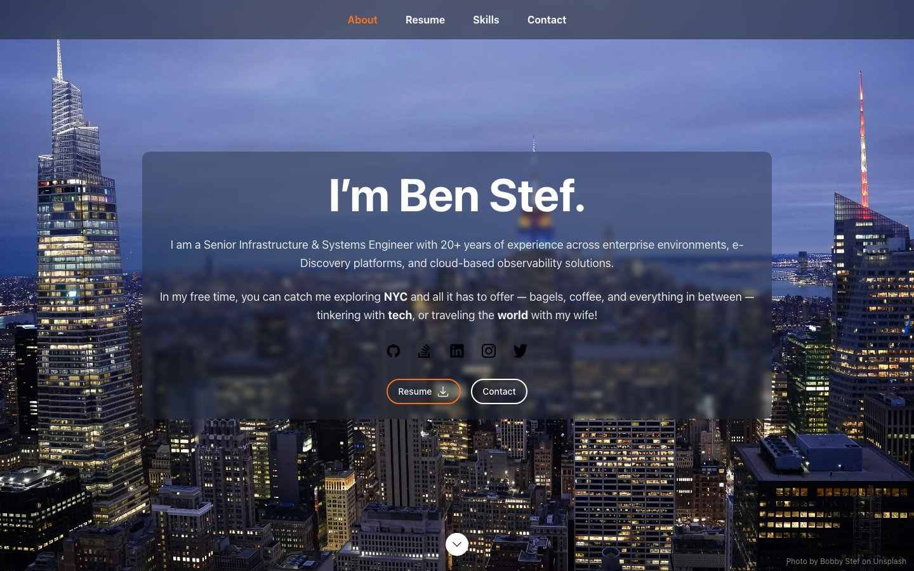

<div align="center">

# Ben Stef — Resume

**Senior Infrastructure & Systems Engineer**, built as a plain HTML/CSS/JS site.




</div>

## Why this exists

This started as a fork of [react-resume-template](https://github.com/bstef/react-resume-template) (Next.js + React + Tailwind). After migrating hosting from AWS Amplify to Cloudflare Pages, the build pipeline kept breaking — webpack quirks, image-optimization config, `output: 'export'` edge cases. None of that complexity was buying anything for a single static page, so this is the same content and design, rebuilt with nothing to compile: one HTML file, one stylesheet, ~50 lines of vanilla JS.

## ✨ Features

- 🪶 **Zero dependencies** — no `node_modules`, no package manager required to run it
- ⚡ **No build step** — what's in the repo is what ships
- 📱 **Responsive** — mobile nav drawer, breakpoints matching the original design
- 🧭 **Scroll-spy navigation** — the nav bar highlights the section you're viewing
- ♿ **Accessible markup** — semantic sections, `aria` labels, `sr-only` text for screen readers

## 🚀 Local preview

Any static file server works:

```bash
npx serve .
```

Then open the printed local URL. Editing `index.html`, `css/style.css`, or `js/main.js` and refreshing is the whole dev loop.

## ☁️ Deploy (Cloudflare Pages)

In the Cloudflare Pages project settings:

- **Build command:** *(leave empty)*
- **Build output directory:** `/`

That's it — every push to the connected branch is served as-is. No build pipeline to break.

## 📁 Structure

```text
.
├── index.html        # the whole page
├── css/style.css      # all styles
├── js/main.js         # mobile menu, scroll-spy, contact form handler
├── images/            # hero background + profile photo
├── resume/            # downloadable resume PDF
├── favicon.ico
└── site.webmanifest
```

## 🛠 Stack

- **Markup:** Semantic HTML5
- **Styling:** Hand-written CSS, no preprocessor
- **Behavior:** Vanilla JS — plain scroll-position spy, no `IntersectionObserver`, no framework
- **Icons:** Inline SVG sprite (`<symbol>`/`<use>`), no icon font or library
- **Hosting:** Cloudflare Pages
